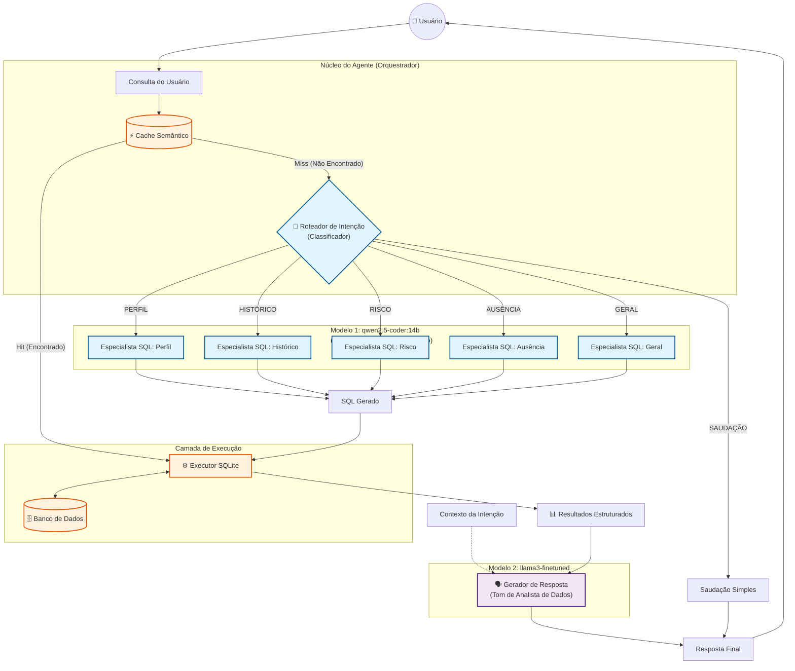

# Agente ClientaTech - Fluxograma da Arquitetura

Este diagrama ilustra a **Arquitetura de Roteamento (Router Architecture)** implementada no agente, mostrando como diferentes modelos são usados para estágios específicos (Roteamento/Geração de Código vs. Análise/Persona).

## Detalhamento dos Componentes

1.  **Roteador de Intenção (`qwen2.5-coder:14b`)**
    *   **Função**: Classificação.
    *   **Tarefa**: Analisa a consulta bruta e a categoriza em um escopo funcional (ex: "Isso é uma pergunta sobre Risco?").
    *   **Por que este modelo?**: Requer forte raciocínio lógico para distinguir diferenças sutis (ex: "Silêncio" vs "Ausência").

2.  **Especialistas em SQL (`qwen2.5-coder:14b`)**
    *   **Função**: Geração de Código.
    *   **Tarefa**: Recebe a intenção específica e converte linguagem natural em sintaxe SQLite precisa.
    *   **Por que este modelo?**: Modelos 'Coder' são ajustados (fine-tuned) para correção de sintaxe e seguimento estrito de regras de esquema.

3.  **Executor**
    *   **Função**: Execução de determinística.
    *   **Tarefa**: Roda o SQL contra o banco de dados local para recuperar dados brutos (JSON/Dicts).

4.  **Analista (`llama3-finetuned`)**
    *   **Função**: Geração de Linguagem Natural.
    *   **Tarefa**: Pega os números brutos e a intenção do usuário para elaborar uma resposta profissional e útil (`pt-BR`).
    *   **Por que este modelo?**: Modelos de propósito geral (como Llama 3) são melhores em "falar" e manter uma persona/tom consistente do que modelos especializados em código.
